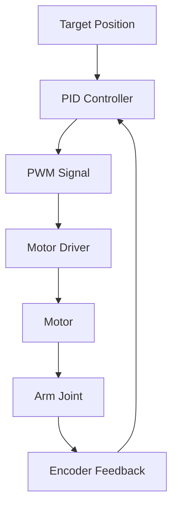

```mermaid
flowchart TD

TargetPosition["Target Position"]
Controller["PID Controller"]
PWM["PWM Signal"]
MotorDriver["Motor Driver"]
Motor["Motor"]
Arm["Arm Joint"]
Encoder["Encoder Feedback"]

TargetPosition --> Controller
Controller --> PWM
PWM --> MotorDriver
MotorDriver --> Motor
Motor --> Arm
Arm --> Encoder
Encoder --> Controller
```
