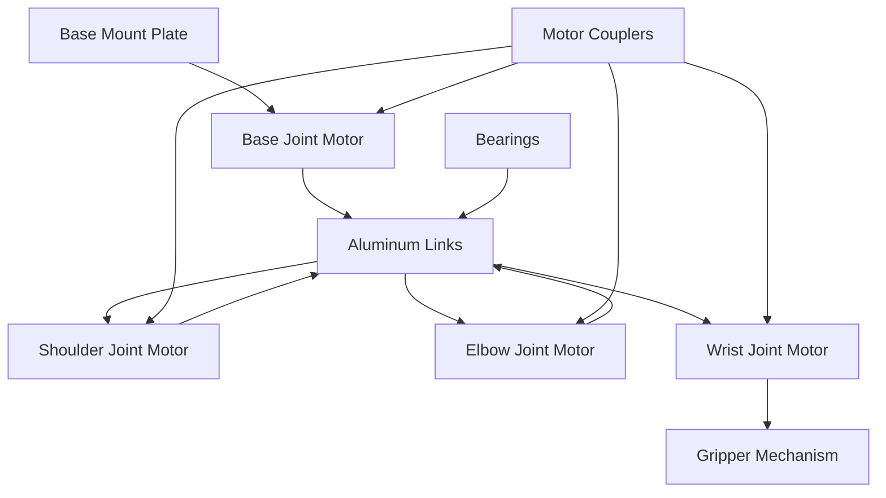

```mermaid
flowchart TD

BaseMount["Base Mount Plate"]
BaseJoint["Base Joint Motor"]
ShoulderJoint["Shoulder Joint Motor"]
ElbowJoint["Elbow Joint Motor"]
WristJoint["Wrist Joint Motor"]
Gripper["Gripper Mechanism"]

Links["Aluminum Links"]
Bearings["Bearings"]
Couplers["Motor Couplers"]

BaseMount --> BaseJoint
BaseJoint --> Links
Links --> ShoulderJoint
ShoulderJoint --> Links
Links --> ElbowJoint
ElbowJoint --> Links
Links --> WristJoint
WristJoint --> Gripper

Bearings --> Links
Couplers --> BaseJoint
Couplers --> ShoulderJoint
Couplers --> ElbowJoint
Couplers --> WristJoint
```
