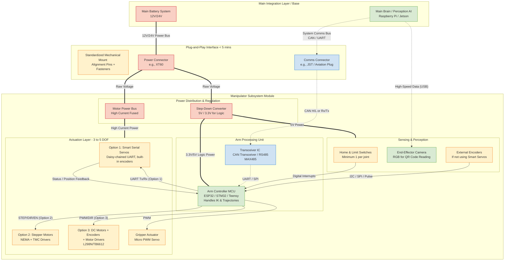

```mermaid
graph TD
    %% Styling Definitions
    classDef power fill:#f9d0c4,stroke:#e06666,stroke-width:2px;
    classDef comms fill:#cfe2f3,stroke:#6fa8dc,stroke-width:2px;
    classDef compute fill:#d9ead3,stroke:#93c47d,stroke-width:2px;
    classDef physical fill:#fff2cc,stroke:#f6b26b,stroke-width:2px;
    classDef external fill:#f3f3f3,stroke:#999999,stroke-width:2px,stroke-dasharray: 5 5;

    %% External Systems (Integration Layer)
    subgraph External [Main Integration Layer / Base]
        MainBat[Main Battery System <br/> 12V/24V]:::power
        MainSoC[Main Brain / Perception AI <br/> Raspberry Pi / Jetson]:::compute
    end

    %% Plug and Play Interface (Mandatory Requirement)
    subgraph PnP [Plug-and-Play Interface < 5 mins]
        MechMount[Standardized Mechanical Mount <br/> Alignment Pins + Fasteners]:::physical
        PowerConn[Power Connector <br/> e.g., XT60]:::power
        DataConn[Comms Connector <br/> e.g., JST / Aviation Plug]:::comms
    end

    %% Main Manipulator Subsystem
    subgraph ManipulatorModule [Manipulator Subsystem Module]
        
        %% Power Distribution
        subgraph PowerReg [Power Distribution & Regulation]
            MotorPwr[Motor Power Bus <br/> High Current Fused]:::power
            Buck[Step-Down Converter <br/> 5V / 3.3V for Logic]:::power
        end

        %% Controller
        subgraph Controller [Arm Processing Unit]
            ArmMCU[Arm Controller MCU <br/> ESP32 / STM32 / Teensy <br/> Handles IK & Trajectories]:::compute
            CommsIC[Transceiver IC <br/> CAN Transceiver / RS485 MAX485]:::comms
        end

        %% Sensors
        subgraph Sensing [Sensing & Perception]
            LimitSW[Home & Limit Switches <br/> Minimum 1 per joint]:::physical
            EndCamera[End-Effector Camera <br/> RGB for QR Code Reading]:::compute
            JointEnc[External Encoders <br/> If not using Smart Servos]:::physical
        end

        %% Actuators (Options included)
        subgraph Actuation [Actuation Layer - 3 to 5 DOF]
            direction TB
            Opt1[Option 1: Smart Serial Servos <br/> Daisy-chained UART, built-in encoders]:::physical
            Opt2[Option 2: Stepper Motors <br/> NEMA + TMC Drivers]:::physical
            Opt3[Option 3: DC Motors + Encoders <br/> + Motor Drivers L298N/TB6612]:::physical
            Gripper[Gripper Actuator <br/> Micro PWM Servo]:::physical
        end
    end

    %% --- Connections ---

    %% External to Interface
    MainBat == "12V/24V Power Bus" === PowerConn
    MainSoC -. "System Comms Bus <br/> CAN / UART" .-> DataConn
    MainSoC -. "High-Speed Data (USB)" .-> EndCamera

    %% Interface to Internals
    PowerConn == "Raw Voltage" === MotorPwr
    PowerConn == "Raw Voltage" === Buck
    DataConn -. "CAN H/L or Rx/Tx" .-> CommsIC

    %% Power Routing
    Buck == "3.3V/5V Logic Power" === ArmMCU
    Buck == "5V Power" === Sensing
    MotorPwr == "High Current Power" === Actuation

    %% Internal Data & Logic Routing
    CommsIC -. "UART / SPI" .-> ArmMCU
    
    %% MCU to Actuators
    ArmMCU -- "UART Tx/Rx (Option 1)" --> Opt1
    ArmMCU -- "STEP/DIR/EN (Option 2)" --> Opt2
    ArmMCU -- "PWM/DIR (Option 3)" --> Opt3
    ArmMCU -- "PWM" --> Gripper

    %% Sensors to MCU
    LimitSW -- "Digital Interrupts" --> ArmMCU
    JointEnc -- "I2C / SPI / Pulse" --> ArmMCU
    
    %% Feedback Loops
    Opt1 -- "Status / Position Feedback" --> ArmMCU
```